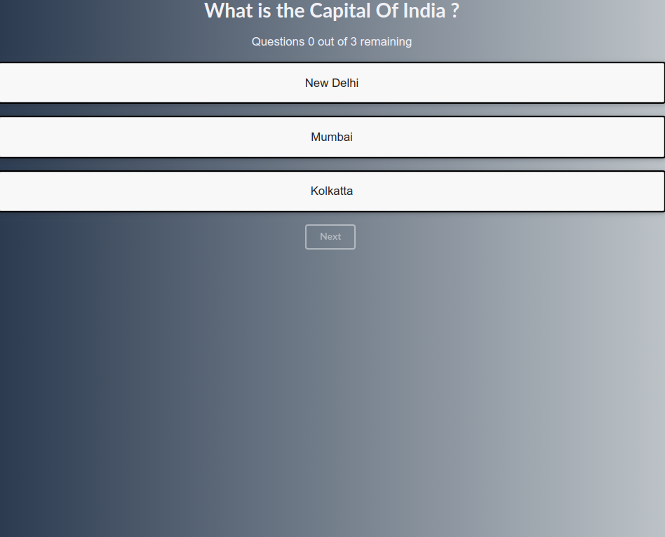

# QuizApp-React
A simple quiz app in React.js

## Preview


## Installation
To install and run the quiz app run the following commands on terminal
```
git clone https://github.com/kuruma99/QuizApp-React.git
cd QuizApp-React
npm install
npm start
```

## Requirements
* Recent Version of Node.js
* npm 
* A web browser

## Features
- [x] No framework used like bootstrap
- [x] Custom CSS
- [x] Used both functional and classed based components
- [x] No use of Redux or Context API
